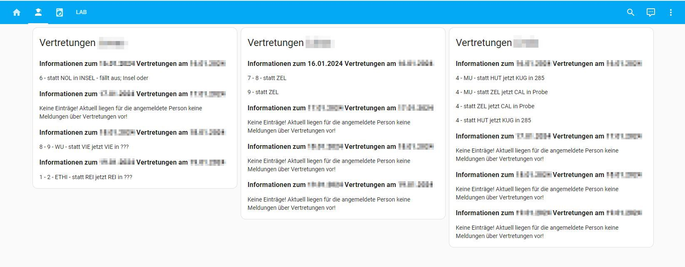

# KSF data fetcher
[](https://github.com/hacs/integration)

This component adds support for [KSF substitutions] to Home Assistant:

If you like this component, please give it a star on [github](https://github.com/tLupus1978/ksf_data).

## Installation

1. Ensure that [HACS](https://hacs.xyz) is installed.
2. Install **ksf_data** integration via HACS.
3. Add configuration section in home assistant configuration
4. You'll need to restart Home Assistant now!

In case you would like to install manually:

1. Copy the folder `custom_components/ksf_data` to `custom_components` in your Home Assistant `config` folder.
2. Add configuration section in home assistant configuration

## Configuration
The plugin can not be configured via the UI, so you'll need to write some YAML.
You'll need to add instances of the ```sensor``` integration with the ksf_data - see below
It is recommended, to use [Home Assistans feature for storing secrets](https://www.home-assistant.io/docs/configuration/secrets/), in order to not directly include them in your configuration.yaml.

```yaml
sensor:
    - platform: ksf_data
      name:  Usable name
      username: <schulportal login name>
      password: <schulportal password>
    - platform: ksf_data
      name:  Heinz Müller
      username: heinz.mueller
      password: 12012006
    ...
```

## What it does
A very simple Home Assistant custom component to query the schulportal.hessen.de for Kopernikusschule Freigericht (KSF).
As the schulportal page changes sometimes, it could be that there are changes required for fetching the data from the page.

Sadly, the LANIS API (https://github.com/kurwjan/LanisAPI) is not working for the KSF, therefore this component is based on an own implementation.

See sensor.py - the component fetches the data every 10 minutes from the schulportal page.

## Usage in Home Assistant UI
You can use this to get the data in a good strucutre (markdown card!)

```yaml


### {{ data[i]['date'] }}


{{ data[i]['substitutions'][s]['notice'] }}

{{ data[i]['substitutions'][s]['hours'] }}  - {{ data[i]['substitutions'][s]['subject_old'] }}  - statt {{ data[i]['substitutions'][s]['teacher'] }}  jetzt {{ data[i]['substitutions'][s]['substitute'] }}   in {{ data[i]['substitutions'][s]['room'] }}   - {{ data[i]['substitutions'][s]['notice'] }} 



```
see e.g.: 

